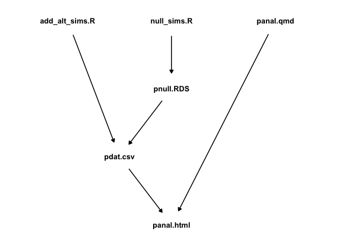

Simple example of a Makefile
================
David Gerard

<!-- README.md is generated from README.Rmd. Please edit that file -->

## Introduction

This is a simple example of using a Makefile to organize the pipeline of
a basic data analysis.

The files in the final report are:

  - Makefile
  - Readme.Rmd
  - Readme.md
  - analysis
      - add\_alt\_sims.R
      - null\_sims.R
      - panal.html
      - panal.Rmd
  - output
      - add\_alt\_sims.Rout
      - null\_sims.Rout
      - pdat.csv
      - pnull.RDS

These files have the following dependency structure:

<!-- -->

See the
[Makefile](https://github.com/data-science-master/pvalue_sims/blob/master/Makefile)
for how to organize this dependency structure.
